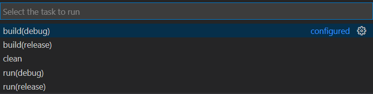

> 本配置以https://github.com/hysonger/VSCode-CPP-Template 为模板，根据我自己的实际情况做出修改，并修正了原作者`build.py`文件中的一处bug
>
> 在此十分感谢原作者，他选择用python脚本执行cmake，大幅度地摆脱了vscode对于插件的依赖性

这是在gcc/g++或clang/clang++下通过python脚本调用Cmake同时编译多文件工程的配置方式，相应的配置文件在[这里](../cmakepygccgpp) 

具体使用方法，请查阅原作者的github仓库

以下是我自己的补充内容：

---

## 前置条件

> gcc/g++和clang/clang++只能二选一，二者配置文件存在冲突

需要环境：

* Python（加入环境变量。用于运行`build.py`脚本）
* （可选）如果你想用`clang/clang++`编译器，请安装LLVM（务必安装到默认位置`C:/Program Files/`）如果你想用`gcc/g++`编译器，则不需要LLVM
* MinGW（如果你想用`clang/clang++`编译器，请把MinGW文件夹下的所有内容合并到LLVM目录下。如果你想用`gcc/g++`编译器，请务必安装到默认位置`C:/Program Files/`）
* CMake（请务必安装到默认位置`C:/Program Files/`）

需要vscode插件：

* C/C++
* CMake

另外：

* 原作者提到的`Include Autocomplete`插件可以不安装，这只是用于智能提示头文件的。而C/C++插件也同样有智能提示功能
* **如果安装了`Clang Command Adapter`，需要禁用或删除** 

---

## 启用gcc/g++或clang/clang++

> **下面两种方案你只能二选一，因为二者有冲突** 

### 1.gcc/g++编译器的配置

在`CMakeLists.txt`文件中，根据注释的提示，注释掉第2和3语句，并取消注释第1条语句

### 2.clang/clang++编译器的配置

在`CMakeLists.txt`文件中，根据注释的提示，注释掉第1条语句，并取消注释第2和3语句（文档目前默认已经处于clang/clang++编译器配置下）

---

## C或C++语言适配

> **下面两种方案你只能二选一，因为二者有冲突** 

### 1. C++程序的配置

如果你需要编写C++程序（文件后缀为`.cpp`），你只需：

* 将`c_cpp_properties.json`文件中的`"compilerPath"`字段后面的路径改成你的`MinGW`对应的`g++.exe`所在目录（需要精确到`/g++.exe`），如果上一步中你安装到了推荐的默认位置，则不需要这一步骤

### 2. C程序的配置

* 由于时间原因，我没有尝试，你可以根据gcc/g++方式编译的[README](./README-gcc.md)和[配置文件](../gcc_g++)自行修改
* 你可以尝试：将`c_cpp_properties.json`文件中的`"compilerPath"`字段后面的路径改成你的`MinGW`对应的`gcc.exe`所在目录（需要精确到`/gcc.exe`）
* 你也可以尝试：将`CMAKE_CXX_FLAGS`改为`CMAKE_C_FLAGS` 。原因我已在注释中写明

---

## 自定义代码格式化风格（可选）

在`settings.json`文件中的`"C_Cpp.clang_format_fallbackStyle"`字段后面，按照自己的需要进行修改

如果需要默认风格，请将此字段注释掉或删除

更改代码风格入门：

* （科学上网）https://stackoverflow.com/questions/46111834/format-curly-braces-on-same-line-in-c-vscode 
* （科学上网）https://medium.com/@zamhuang/vscode-%E5%A6%82%E4%BD%95%E5%9C%A8-vscode-%E4%B8%8A%E8%87%AA%E5%AE%9A%E7%BE%A9-c-%E7%9A%84-coding-style-c8eb199c57ce 

---

## 注意事项

* 工作区文件夹（也就是目前的`cmakepygccgpp`）不能含有特殊字符（比如下划线`_`和加号`+`等其他字符。因为`tasks.json`中含有正则表达式，会导致不匹配，你可以自行查看`tasks.json`的匹配规则），否则执行`clean`任务（见下面使用方法）时，会报错`Traceback (most recent call last)`，即变量未定义。
* 工作区和文件的路径不能含有中文
* `clean_workspace_exe.bat`用于清除你不想要的`.exe`文件。你也可以用下面的`clean`任务达到目的

---

## 使用方法：

`ctrl + shift + P`，输入`tasks`，选择`Run Task`，然后根据原作者的说明，选择你需要执行的task。

包括以下`task`：

如果你需要调试，直接打好断点，按`F5`即可

---

## 参考

* https://github.com/hysonger/VSCode-CPP-Template
