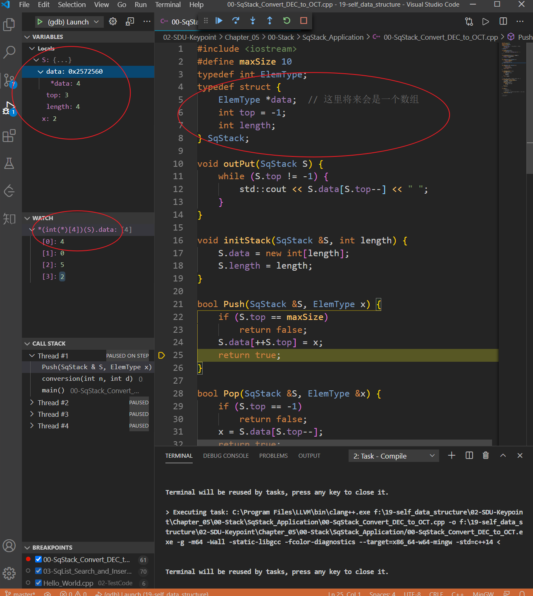

C语言的数组经过函数传递以后会退化为指针，直接添加表达式就只能看到第一个元素。此时可以强制转换成指向固定大小的数组指针再解引：例如`int arr[10]`传进函数里后就变成了`int* arr`，在Watch里添加`*(int(*)[10])arr`，这样就能看到完整的数组了。但长度必须是写死的，自己小心越界。或者简单的程序用全局变量数组就能一直看到了。另一种只对gdb且是非void*有效的写法：`*arr@10`。

作者：谭九鼎
链接：https://www.zhihu.com/question/30315894/answer/154979413
来源：知乎
著作权归作者所有。商业转载请联系作者获得授权，非商业转载请注明出处。

---

补充：对于结构体内的强制转换（以顺序栈为例）

